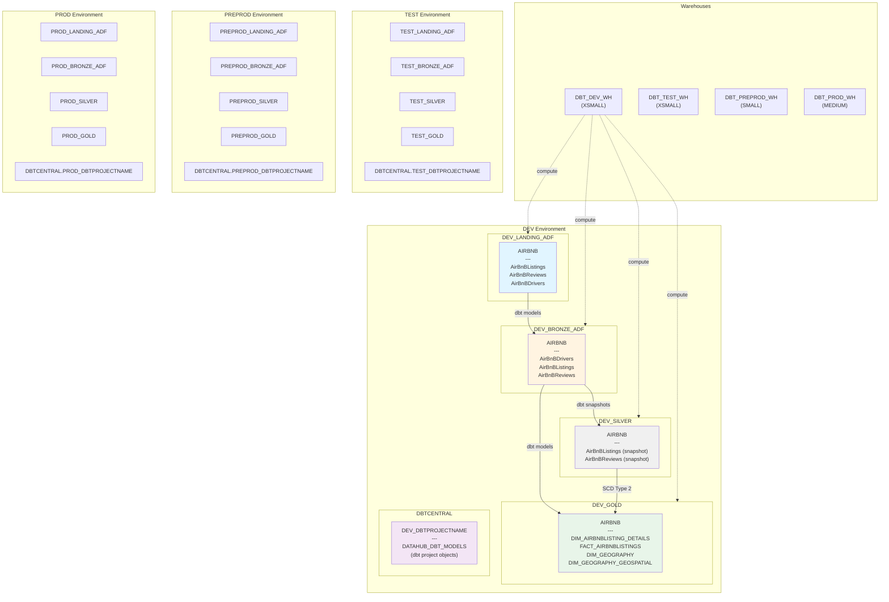
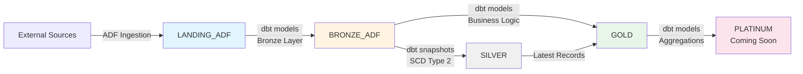

# Snowflake Database Architecture

## Overview

This document describes the database, schema, warehouse, and table structure used in our dbt on Snowflake project across all environments (DEV, TEST, PREPROD, PROD).

---

## Architecture Diagram



---

## Database Structure by Layer

### Landing Layer (`{ENV}_LANDING_ADF`)

**Purpose:** Raw data ingestion from external sources (ADF = Azure Data Factory)

**Schemas:**
- `AIRBNB` - AirBnB source data

**Tables:**
| Table Name | Type | Description |
|------------|------|-------------|
| `AirBnBListings` | Raw | Listing metadata (id, name, host, price, etc.) |
| `AirBnBReviews` | Raw | User reviews (listing_id, reviewer, comments) |
| `AirBnBDrivers` | Variant/JSON | Driver metadata as JSON payload |

**Naming Convention:**
- Case-sensitive quoted identifiers (e.g., `"AirBnBListings"`)
- All columns prefixed with system tracking fields:
  - `SYSLOADDATE`
  - `SYSRUNID`
  - `SYSPROCESSINGTOOL`
  - `SYSDATAPROCESSORNAME`
  - `SOURCESYSTEM`

---

### Bronze Layer (`{ENV}_BRONZE_ADF`)

**Purpose:** Initial transformation - type casting, basic cleansing

**Schemas:**
- `AIRBNB`

**Tables:**
| Table Name | dbt Model | Description |
|------------|-----------|-------------|
| `AIRBNBDRIVERS` | `airbnb_bronze_drivers.sql` | Flattened driver data from JSON |
| `AIRBNBLISTINGS` | `airbnb_bronze_listings.sql` | Type-cast listings (VARCHAR → INT/DATE) |
| `AIRBNBREVIEWS` | `airbnb_bronze_reviews.sql` | Type-cast reviews |

**Transformations:**
- Data type casting (VARCHAR → INT, DATE, etc.)
- Add dbt metadata fields (`SYSRUNID`, `invocation_id`)
- Source: Landing layer tables

---

### Silver Layer (`{ENV}_SILVER`)

**Purpose:** Slowly Changing Dimensions (SCD Type 2) - historical tracking

**Schemas:**
- `AIRBNB`

**Tables:**
| Table Name | dbt Snapshot | Description |
|------------|--------------|-------------|
| `AIRBNBLISTINGS` | `airbnb_silver_listings` | SCD Type 2 snapshot of listings |
| `AIRBNBREVIEWS` | `airbnb_silver_reviews` | SCD Type 2 snapshot of reviews |

**SCD Columns:**
- `DBT_VALID_FROM`
- `DBT_VALID_TO`
- `DBT_UPDATED_AT`
- `DBT_SCD_ID`

**Snapshot Strategy:**
- Strategy: `timestamp`
- Updated at: `DBT_UPDATED_AT`

---

### Gold Layer (`{ENV}_GOLD`)

**Purpose:** Business logic, facts, dimensions - analytics-ready

**Schemas:**
- `AIRBNB`

**Tables:**
| Table Name | Type | dbt Model | Description |
|------------|------|-----------|-------------|
| `DIM_AIRBNBLISTING_DETAILS` | Dimension | `airbnb_gold_dim_listing_details.sql` | Listing details dimension |
| `FACT_AIRBNBLISTINGS` | Fact | `airbnb_gold_fact_listings.sql` | Listings fact table with metrics |
| `DIM_GEOGRAPHY` | Dimension | (Pre-created) | Geography master data |
| `DIM_GEOGRAPHY_GEOSPATIAL` | Dimension | (Pre-created) | Geospatial reference data |

**Fact Table Metrics:** (`FACT_AIRBNBLISTINGS`)
- `PRICE`
- `MINIMUM_NIGHTS`
- `NUMBER_OF_REVIEWS`
- `HOST_LISTING_COUNT`
- `AVAILABILITY`
- `REVIEWS_PER_MONTH`
- `VALUE_CATEGORY` *(High Value / Medium Value / Standard)*

**Joins:**
- Silver layer snapshots (latest records where `DBT_VALID_TO IS NULL`)
- Gold dimension tables

---

## dbt Project Storage (`DBTCENTRAL`)

**Purpose:** Stores dbt project objects deployed by Snowflake CLI

**Schemas:**
- `DEV_DBTPROJECTNAME` - DEV environment dbt projects
- `TEST_DBTPROJECTNAME` - TEST environment dbt projects
- `PREPROD_DBTPROJECTNAME` - PREPROD environment dbt projects
- `PROD_DBTPROJECTNAME` - PROD environment dbt projects

**Objects:**
| Object Name | Type | Description |
|-------------|------|-------------|
| `DATAHUB_DBT_MODELS` | DBT PROJECT | Deployed dbt project with all models, tests, snapshots |

**Deployment:**
- Deployed via: `snow dbt deploy`
- Executed via: `snow dbt execute`

---

## Warehouse Configuration

| Warehouse | Size | Auto Suspend | Environment | Purpose |
|-----------|------|--------------|-------------|---------|
| `DBT_DEV_WH` | XSMALL | 60 seconds | DEV | Development, CI/CD |
| `DBT_TEST_WH` | XSMALL | 60 seconds | TEST | QA testing |
| `DBT_PREPROD_WH` | SMALL | 60 seconds | PREPROD | Pre-production validation |
| `DBT_PROD_WH` | MEDIUM | 300 seconds | PROD | Production workloads |

**Cost Optimization:**
- Warehouses auto-suspend when idle
- DEV/TEST use smaller sizes (XSMALL)
- PROD uses larger size (MEDIUM) for performance

---

## Environment Naming Pattern

All databases follow this pattern:

```
{ENV}_{LAYER}_{SOURCE}

Where:
  ENV    = DEV | TEST | PREPROD | PROD
  LAYER  = LANDING | BRONZE | SILVER | GOLD | PLATINUM
  SOURCE = ADF (Azure Data Factory) | [other sources]
```

**Examples:**
- `DEV_LANDING_ADF` - DEV landing from ADF
- `TEST_BRONZE_ADF` - TEST bronze from ADF  
- `PROD_GOLD` - PROD gold layer

**Exception:** `DBTCENTRAL` database is shared across all environments, with schema-level separation.

---

## Data Flow



**Steps:**
1. **Landing** - Raw data from ADF ingestion
2. **Bronze** - Type casting, basic transformations
3. **Silver** - Historical tracking (SCD Type 2)
4. **Gold** - Business logic, facts & dimensions
5. **Platinum** *(Future)* - Aggregated marts

---

## Roles & Permissions

| Role | Databases | Warehouse | Purpose |
|------|-----------|-----------|---------|
| `DBT_DEV_ROLE` | All DEV_* databases, DBTCENTRAL | DBT_DEV_WH | Development, CI/CD |
| `DBT_TEST_ROLE` | All TEST_* databases, DBTCENTRAL | DBT_TEST_WH | QA testing |
| `DBT_PREPROD_ROLE` | All PREPROD_* databases, DBTCENTRAL | DBT_PREPROD_WH | Pre-prod validation |
| `DBT_PROD_ROLE` | All PROD_* databases, DBTCENTRAL | DBT_PROD_WH | Production |

**CI/CD Users:**
- `GHA_DBT_DEV` - GitHub Actions service account for DEV
- `GHA_DBT_TEST` - GitHub Actions service account for TEST
- `GHA_DBT_PREPROD` - GitHub Actions service account for PREPROD  
- `GHA_DBT_PROD` - GitHub Actions service account for PROD

**Authentication:**
- All CI/CD uses RSA key-pair (JWT) authentication
- No passwords stored in GitHub

---

## Quick Reference Commands

### View All Databases
```sql
SHOW DATABASES LIKE '%DEV%';
SHOW DATABASES LIKE '%TEST%';
SHOW DATABASES LIKE '%PROD%';
```

### View Schema Contents
```sql
USE DATABASE DEV_GOLD;
SHOW SCHEMAS;

USE SCHEMA AIRBNB;
SHOW TABLES;
```

### Check Table Counts
```sql
-- Landing
SELECT 'Listings' AS TBL, COUNT(*) FROM DEV_LANDING_ADF.AIRBNB."AirBnBListings"
UNION ALL
SELECT 'Reviews', COUNT(*) FROM DEV_LANDING_ADF.AIRBNB."AirBnBReviews";

-- Gold
SELECT 'Fact', COUNT(*) FROM DEV_GOLD.AIRBNB.FACT_AIRBNBLISTINGS
UNION ALL
SELECT 'Dim', COUNT(*) FROM DEV_GOLD.AIRBNB.DIM_AIRBNBLISTING_DETAILS;
```

### View dbt Projects
```sql
USE DATABASE DBTCENTRAL;
USE SCHEMA DEV_DBTPROJECTNAME;

SHOW DBT PROJECTS;
```

---

## Notes

- **Case Sensitivity**: Landing tables use quoted identifiers (case-sensitive)
- **Incremental Models**: Some gold tables use incremental strategy with merge
- **Testing**: dbt tests run automatically in CI/CD after builds
- **Snapshots**: Silver layer snapshots run before gold models
- **Dependencies**: dbt automatically resolves model dependencies via `ref()` and `source()`
