# ✅ Pytest Integration Complete - Summary of Changes

## Files Modified

### 1. Test Configuration Files

#### [`conftest.py`](file:///c:/Users/pasivalingam/repos/snowflake-dbt/datahub_refinery/tests/conftest.py)
**Changes:**
- ✅ Fixed path references from `src/` to current `tests/` directory
- ✅ Added JWT authentication support with private key parsing
- ✅ Updated `sf_conn` fixture to accept both JWT and password auth
- ✅ Added cryptography library imports for key parsing

**Impact:** Tests can now authenticate using RSA key-pair (same as CI/CD)

---

#### [`requirement.txt`](file:///c:/Users/pasivalingam/repos/snowflake-dbt/datahub_refinery/tests/requirement.txt)
**Changes:**
- ✅ Added `cryptography` for JWT key parsing
- ✅ Fixed package name from `dotenv` to `python-dotenv`

**Impact:** All dependencies for JWT authentication are now included

---

#### [`Data/variables.py`](file:///c:/Users/pasivalingam/repos/snowflake-dbt/datahub_refinery/tests/Data/variables.py)
**Changes:**
- ✅ Made database names dynamic based on `SNOWFLAKE_DATABASE` env var
- ✅ Extracts environment prefix (DEV/TEST/PREPROD/PROD) automatically
- ✅ Constructs `landing_db` and `bronze_db` based on environment

**Impact:** Same tests work across all environments without modification

---

#### [`.env`](file:///c:/Users/pasivalingam/repos/snowflake-dbt/datahub_refinery/tests/.env)
**Changes:**
- ✅ Updated to use JWT authentication (`SNOWFLAKE_AUTHENTICATOR=SNOWFLAKE_JWT`)
- ✅ Changed user to `GHA_DBT_DEV` (matches CI/CD)
- ✅ Updated role, warehouse, database, schema to match DEV environment
- ✅ Removed password (no longer needed with JWT)

**Impact:** Local testing now uses same auth method as CI/CD

---

### 2. GitHub Actions Workflow

#### [`dev-deploy.yml`](file:///c:/Users/pasivalingam/repos/snowflake-dbt/.github/workflows/dev-deploy.yml)
**Changes:**
- ✅ Added "Run pytest tests" step after dbt build
- ✅ Configured environment variables using GitHub secrets
- ✅ Set to run tests in `datahub_refinery/tests` directory
- ✅ Added "Upload pytest report" step with `if: always()` (runs even if tests fail)
- ✅ Generates HTML report with `--self-contained-html`

**Impact:** Pytest tests run automatically on every push to `feature/*` branches

---

## What Happens Now

### 1. When You Push Code

```mermaid
flowchart LR
    A[Git Push] -->|Triggers| B[GitHub Actions]
    B --> C[Checkout Code]
    C --> D[Setup Python]
    D --> E[Install Snowflake CLI + dbt]
    E --> F[Deploy dbt Project]
    F --> G[Execute dbt Build]
    G -->|Success| H[Run Pytest Tests]
    H -->|Generate| I[HTML Report]
    I --> J[Upload Artifacts]
    
    style G fill:#e8f5e9
    style H fill:#fff9c4
    style I fill:#e1f5ff
```



### 2. Test Execution Flow

1. **dbt build completes** → All models, snapshots, and dbt tests pass
2. **pytest installs dependencies** → From `requirement.txt`
3. **pytest connects to Snowflake** → Using JWT authentication with `/home/runner/sf_key.p8`
4. **Tests run** → Currently `test_AirBnBDrivers.py` with 2 tests
5. **HTML report generated** → `report.html` with pass/fail details
6. **Artifacts uploaded** → Available for download in GitHub Actions

---

## Next Steps

### Immediate: Test Locally

Before pushing, test JWT authentication locally:

```bash
# Navigate to tests directory
cd c:\Users\pasivalingam\repos\snowflake-dbt\datahub_refinery\tests

# Install dependencies
pip install -r requirement.txt

# Set environment variables (PowerShell)
$env:SNOWFLAKE_ACCOUNT = "your_account_id"
$env:SNOWFLAKE_USER = "GHA_DBT_DEV"
$env:SNOWFLAKE_AUTHENTICATOR = "SNOWFLAKE_JWT"
$env:SNOWFLAKE_PRIVATE_KEY_PATH = "$HOME/.snowflake/sf_key.p8"
$env:SNOWFLAKE_ROLE = "DBT_DEV_ROLE"
$env:SNOWFLAKE_WAREHOUSE = "DBT_DEV_WH"
$env:SNOWFLAKE_DATABASE = "DEV_BRONZE_ADF"
$env:SNOWFLAKE_SCHEMA = "AIRBNB"

# Run tests
pytest -v --html=report.html --self-contained-html
```

**Expected Output:**
```
======================== test session starts =========================
bronze_adf/test_AirBnBDrivers.py::test_landing_bronze_count PASSED [ 50%]
bronze_adf/test_AirBnBDrivers.py::test_landing_bronze_dataValidation PASSED [100%]
======================== 2 passed in 4.32s ==========================
```

---

### Then: Commit and Push

```bash
# From project root
cd c:\Users\pasivalingam\repos\snowflake-dbt

# Stage all changes
git add datahub_refinery/tests/conftest.py
git add datahub_refinery/tests/requirement.txt
git add datahub_refinery/tests/Data/variables.py
git add datahub_refinery/tests/.env
git add .github/workflows/dev-deploy.yml

# Commit
git commit -m "feat: integrate pytest tests into CI/CD pipeline

- Add JWT authentication support to conftest.py
- Make test variables environment-aware
- Add pytest execution to dev-deploy workflow
- Update requirements with cryptography package
- Configure tests to use same credentials as dbt"

# Push
git push origin feature/dbtcicd21
```

---

### After: Verify in GitHub Actions

1. **Navigate to:** `https://github.com/YOUR_ORG/snowflake-dbt/actions`
2. **Find your workflow run** (latest at the top)
3. **Click on the workflow** to see steps
4. **Expand "Run pytest tests"** to see test output
5. **Download artifacts:**
   - Scroll to bottom
   - Click `pytest_report_dev` to download
   - Extract and open `report.html`

---

### Finally: Add to Other Environments

Copy the pytest steps to:
- **TEST:** [`test-deploy.yml`](file:///c:/Users/pasivalingam/repos/snowflake-dbt/.github/workflows/test-deploy.yml) (change `SNOWFLAKE_DATABASE: TEST_BRONZE_ADF`)
- **PREPROD:** [`preprod-deploy.yml`](file:///c:/Users/pasivalingam/repos/snowflake-dbt/.github/workflows/preprod-deploy.yml) (change `SNOWFLAKE_DATABASE: PREPROD_BRONZE_ADF`)
- **PROD:** [`prod-deploy.yml`](file:///c:/Users/pasivalingam/repos/snowflake-dbt/.github/workflows/prod-deploy.yml) (optional)

---

## Troubleshooting

### ❌ "ModuleNotFoundError: No module named 'sf_client'"

**Cause:** Path issue in conftest.py  
**Solution:** Already fixed! `PROJECT_ROOT` now points to `tests/` directory

---

### ❌ "Authentication failed"

**Cause:** Private key not found or incorrect  
**Solution:** 
1. Verify `SNOWFLAKE_PRIVATE_KEY_PATH` points to correct file
2. Ensure file has no password
3. Check GitHub secrets are configured correctly

---

### ❌ "Table AIRBNBDRIVERS does not exist"

**Cause:** dbt build didn't create bronze tables yet  
**Solution:** Ensure dbt build completes successfully before pytest runs

---

### ❌ Tests pass locally but fail in CI/CD

**Cause:** Environment variable mismatch  
**Solution:** Check workflow env vars match local testing

---

## Documentation

For complete step-by-step instructions, see:
📖 **[PYTEST_INTEGRATION_GUIDE.md](file:///c:/Users/pasivalingam/repos/snowflake-dbt/PYTEST_INTEGRATION_GUIDE.md)**

---

## Summary

✅ **5 files updated** with JWT authentication support  
✅ **Tests are environment-aware** (work in DEV/TEST/PREPROD/PROD)  
✅ **CI/CD integration complete** for DEV workflow  
✅ **HTML test reports** generated and uploaded  
✅ **Ready to commit and test** in GitHub Actions  

🎉 **Your pytest tests are now part of your CI/CD pipeline!**
